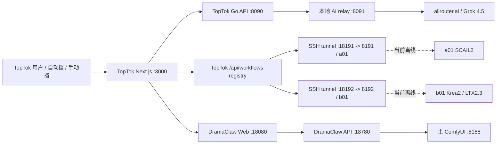

# TopTok / DramaClaw / 4090 服务器工作流交接说明

> 快照时间：2026-07-29 18:26 CST  
> 工作目录：`/Users/owl/Documents/Codex/2026-07-27/tt-2`  
> 用途：交给后续工程师或 Claude 继续部署、接入和商用品质验收。  
> 安全说明：本文不包含服务器密码、站点密码、API Key 或管理 Token。请从负责人提供的安全渠道获取，不要从历史脚本复制到新环境。

## 1. 结论先行

当前系统并不是“五套工作流已经完整接入 DramaClaw 并通过商用验收”的状态。

准确状态如下：

1. 主 ComfyUI、DramaClaw API 和 DramaClaw Web 代理当前在线。
2. PornMaster Krea2 与 Krea2 Identity Edit 的底层 ComfyUI 调用曾成功，但仍是一次性验证脚本，不是正式 DramaClaw provider。
3. LTX-2.3 是五套能力中唯一已经进入 DramaClaw `ComfyUIVideoGenerator` 的正式类型；技术调用成功，但真实样片近静音，商用验收失败。
4. a01/b01 已登记在 TopTok workflow registry，但当前依赖的隔离 ComfyUI 端口离线，且原隔离运行目录已不存在。因此目前不能从 TopTok 正常调用它们。
5. 旧 60 秒作品原始版本无声。补声版只有旁白与环境底噪，仅通过“非静音”技术门禁，不是商用声音设计。
6. 当前没有任何一条 60 秒作品通过“画面、身份、人体、动作、声音、声画同步、成人内容、完整时长”的全链路商用验收。

## 2. 必须遵守的产品与工程约束

1. 静态生图只使用 PornMaster Krea2 Turbo V2 FP8。
2. 人物一致性使用 Krea2 Identity Edit，不再使用此前会把脸处理模糊的旧方案。
3. a01/b01 是作者工作流：不得修改模型、节点和数值参数。允许替换输入图片、输入视频、提示词、随机种子和输出文件名。
4. a01/b01 必须保持服务与目录隔离，不能把作者依赖直接混成一个不可追踪的工作流。
5. 所有成人内容角色必须明确为虚构成年人，建议在结构化角色字段中固定 `age >= 21`，不能只依赖提示词自然语言。
6. 成年确认只在用户首次登录时完成；确认后生成流程不应反复弹确认框。
7. “ComfyUI success”“存在 MP4”“存在 AAC 流”都不能作为最终验收。必须下载并检查最终资产。
8. TopTok 前端只有在所有质量门禁通过后才能显示“作品完成”。

## 3. 当前服务器快照

### 3.1 连接信息

| 项目 | 当前值 |
| --- | --- |
| 公网 SSH | `117.190.94.226:10022` |
| SSH 用户 | `root` |
| 内部地址（历史配置） | `10.2.22.15` |
| 容器镜像 | `yanwk/comfyui-boot:cu130-megapak-pt211-20260701` |
| 当前容器 hostname | `9a9b98f4dc59` |
| GPU | 2 x NVIDIA GeForce RTX 4090，单卡约 24 GB |
| 根文件系统 | 891 GB 总量，565 GB 已用，327 GB 可用，64% |

密码不得写入仓库或本文。SSH 示例：

```bash
ssh -p 10022 root@117.190.94.226
```

### 3.2 当前服务健康状态

2026-07-29 现场探测结果：

| 端口 | 服务 | 当前状态 | 说明 |
| --- | --- | --- | --- |
| `8188` | 主 ComfyUI | HTTP 200 | 当前图像、Identity Edit、LTX 测试的实际 GPU 后端 |
| `8191` | a01 隔离 ComfyUI | 离线 | 请求失败；原 `/root/scail2_stack` 不存在 |
| `8192` | b01 隔离 ComfyUI | 离线 | 请求失败；原 `/root/krea_ltx23_stack` 不存在 |
| `18780` | DramaClaw API | HTTP 200 | 仅监听 `127.0.0.1` |
| `18080` | DramaClaw Web 代理 | HTTP 200 | 仅监听 `127.0.0.1` |

当前 GPU 快照：GPU 0 占用约 18.2 GB，GPU 1 占用约 1.2 GB，探测时利用率均为 0%。这只是瞬时状态，不代表可直接抢占 GPU；提交任务前仍需检查队列和显存。

### 3.3 主要目录与空间

| 路径 | 大小 | 用途 |
| --- | ---: | --- |
| `/root/ComfyUI` | 约 395 GB | 主 ComfyUI、模型、节点、输入输出 |
| `/root/.local/share/dramaclaw` | 约 1.3 GB | DramaClaw 1.1.5 运行环境与源码 |
| `/root/.local/share/dramaclaw-deploy` | 约 186 MB | 部署脚本、验收脚本、发行包 |
| `/root/.local/share/dramaclaw-runtime` | 约 186 MB | 日志、状态、项目输出 |
| `/root/.local/share/toptok-workflows` | 小型工作流资产目录 | a01/b01 JSON、测试输入输出、旧 PID/日志 |
| `/root/ComfyUI/input` | 约 287 MB | 主 ComfyUI 输入 |
| `/root/ComfyUI/output` | 约 468 MB | 主 ComfyUI 输出 |
| `/root/.local/share/dramaclaw-runtime/data/output` | 约 45 MB | DramaClaw 项目与验收输出 |

模型目录占用较大的部分：

| 模型目录 | 大小 |
| --- | ---: |
| `models/checkpoints` | 约 167 GB |
| `models/text_encoders` | 约 99 GB |
| `models/unet` | 约 75 GB |
| `models/loras` | 约 31 GB |
| `models/diffusion_models` | 约 13 GB |
| `models/vae` | 约 2.2 GB |
| `models/latent_upscale_models` | 约 1.9 GB |

## 4. 系统调用关系



需要注意：上图同时包含“设计/配置关系”和“当前运行关系”。当前只有主 ComfyUI 与 DramaClaw 服务已现场确认在线；TopTok 容器本身的线上健康、本地 AI relay、数据库和 Redis 本轮没有拿到独立主机权限做实时复验。

## 5. TopTok 当前配置

### 5.1 LLM 与聊天

历史部署脚本当前配置为：

- 聊天和结构化内容模型：`grok-4.5`
- 外部路由：`allrouter.ai`，通过 TopTok 容器内 Python relay 转发
- Go API：`8090`
- AI relay：`8091`
- Next.js：`3000`

这只能证明部署脚本的配置目标，不能证明线上每一类聊天、人物设定、脚本生成都已实际走 Grok 4.5。接手后应在服务端增加 provider/model/request-id 结构化日志，并分别实测：

1. 普通聊天。
2. 人物设定生成。
3. 剧本与分镜结构化 JSON。
4. 成人向对话边界。
5. fallback 发生时实际使用的模型。

禁止把 API Key 写入日志。当前本地文件 `work/toptok-workflow-registry/start.sh.remote` 含硬编码凭据和弱默认密钥，必须立即完成：

1. 轮换已经出现在脚本中的所有 Token、API Key、数据库密码、管理 Token 和签名密钥。
2. 改为平台 Secret/环境变量注入。
3. 从可共享交接包和后续 Git 历史中移除真实值。
4. 对历史日志做秘密扫描。

### 5.2 TopTok workflow registry

本地代码：

- `work/toptok-workflow-registry/config/workflows.json`
- `work/toptok-workflow-registry/src/app/api/workflows/route.ts`
- `work/toptok-workflow-registry/workflows/`

当前只注册两组：

| ID | 展示名 | 默认 variant | 目标端点 |
| --- | --- | --- | --- |
| `a01` | SCAIL2 Complete Pipeline | `strict_full` | `127.0.0.1:18191` |
| `b01` | Krea 2 / LTX 2.3 Author Workflows | `basic_dmd_v5` | `127.0.0.1:18192` |

b01 variants：

- `basic_dmd_v5`
- `faceid_v2`
- `dr34_full_dev_20step`

API 行为：

- `GET /api/workflows`：列举注册工作流并检查健康。
- `POST /api/workflows`：需要 `x-admin-token`，提交固定 graph。
- `GET /api/workflows?workflow=...&promptId=...`：轮询 ComfyUI history。
- `GET /api/workflows?workflow=...&asset=...`：代理下载最终资产。
- 已处理完成但无资产、execution error、node error 等情况。
- b01 支持输入图片替换；a01 当前 API 不接受 `inputImage` 字段。

当前问题：registry 配置指向 `18191/18192`，但这些 tunnel 的远端 `8191/8192` 服务已经离线。

## 6. 五套工作流逐项说明

### 6.1 PornMaster Krea2 Turbo V2 FP8

用途：人物资产、场景资产、服装资产和静态分镜图，是当前唯一允许使用的静态图基座。

主要模型：

| 文件 | 服务器路径 | 大小约 |
| --- | --- | ---: |
| `pornmasterKrea2_turboV2FP8.safetensors` | `/root/ComfyUI/models/diffusion_models/` | 13.14 GB |
| `qwen_image_vae.safetensors` | `/root/ComfyUI/models/vae/` | 254 MB |
| `qwen3vl_4b_fp8_scaled.safetensors` | `/root/ComfyUI/models/text_encoders/` | 5.24 GB |

当前调用方式：`work/dramaclaw_toptok_validation.py` 和 `work/krea2_image_acceptance.py` 自建 graph，直接提交主 ComfyUI `8188`。

当前接入结论：

- 底层生图：成功。
- DramaClaw 正式 provider：没有。
- TopTok workflow registry：没有独立注册项。
- 商用成人视觉验收：未完成。

已知样本任务：`70d7a06a-3363-4d12-8d2c-b98b4909fdd5`，输出 768x1152。

### 6.2 Krea2 Identity Edit v1.2

用途：基于 canonical 角色参考图生成不同镜头，同时保持人物身份。

主要依赖：

| 文件/节点 | 路径 |
| --- | --- |
| Identity LoRA | `/root/ComfyUI/models/loras/Krea2IdentityEdit/krea2_identity_edit_v1_2.safetensors`，约 1.83 GB |
| 自定义节点 | `/root/ComfyUI/custom_nodes/comfyui-krea2edit` |
| 基座 | PornMaster Krea2 Turbo V2 FP8 |

当前调用方式：一次性 Python graph 直接调用 `8188`，使用 `Krea2EditModelPatch` 与 `Krea2EditGroundedEncode`。

三镜头实测任务：

- close-up：`a7b34394-8d87-42aa-b13c-26dc14255ac7`
- three-quarter：`29134634-e103-4a7d-95b8-2c5002849d74`
- full-body：`cca4f982-7f77-4b68-8e91-f3e437938520`

SFace 自动指标：

- 对 canonical：`0.486 / 0.688 / 0.818`
- 三图之间最低：`0.391`
- 均超过 OpenCV SFace 常用同人阈值约 `0.363`，但近景明显弱于全身。

当前接入结论：底层可运行，尚无 DramaClaw provider，也没有完整人工视觉验收。

### 6.3 DramaClaw 内置 LTX-2.3

代码位置：

- `work/dramaclaw/src/novelvideo/generators/video_generator.py`
- `work/dramaclaw/src/novelvideo/generators/ltx2-3-I2V.json`

调用类型：

```python
ComfyUIVideoGenerator(workflow_type="ltx23")
```

主要模型：

| 文件 | 服务器位置 | 大小约 |
| --- | --- | ---: |
| `ltx-2.3-22b-dev.safetensors` | `models/checkpoints` | 46.15 GB |
| `ltx-2.3-22b-distilled-lora-384.safetensors` | `models/loras` | 已存在 |
| `ltx-2.3-spatial-upscaler-x2-1.0.safetensors` | `models/latent_upscale_models` | 996 MB |
| `gemma_3_12B_it_fp4_mixed.safetensors` | `models/text_encoders` | 9.45 GB |

注意：spatial upscaler 必须在 `models/latent_upscale_models`。早期恢复脚本错误放到 `models/upscale_models`，现已修复恢复脚本，但错误目录里仍有一份同名文件。不要在没有引用审计前直接删除。

真实任务：`4c148bb3-deae-4341-a0a6-204b967d3116`

结果：

- 2.0417 秒
- 704x1280
- H.264 + AAC 48 kHz stereo
- 平均响度 `-51.5 dB`
- 峰值 `-19.9 dB`
- 结论：视频链路运行成功，但音频近静音，商用验收失败。

### 6.4 a01：SCAIL2 Complete Pipeline

来源名称：`1GirlUniversity SCAIL2 Complete Pipeline Master Pack`。

固定 graph：`work/toptok-workflow-registry/workflows/a01_scail2_strict_full_api.json`

主要依赖包括：

- `wan2.1_14B_SCAIL_2_fp8_scaled.safetensors`
- `wan2.1_SCAIL_2_DPO_lora_bf16.safetensors`
- LightX2V LoRA
- Pusa LoRA
- `genitals_helper_v1.0_e219.safetensors`
- `nsfw_wan_umt5-xxl_fp8_scaled.safetensors`
- Wan 2.1 VAE、CLIP Vision、SAM3 等

现场抽查的关键模型均存在于主 ComfyUI 模型目录。但当前问题不是主模型缺失，而是隔离服务不存在：

- `8191` 离线。
- `/root/scail2_stack` 不存在。
- `/root/.local/share/toptok-workflows/a01` 只保留 graph、测试输入输出、旧 PID 和日志。
- 本地历史启动脚本仍指向 `/root/scail2_stack`，已失效，不能直接执行。

真实输入测试：任务 `1161baaf-669f-49d0-8693-a370123ab9b6`。

- 输入 120 帧，输出 117 帧，约 3.9 秒。
- a01 不生成独立声音，只继承源视频音轨。
- 0 至 2.5 秒单脸相对稳定，对参考 SFace `0.742-0.816`。
- 3.0 秒相似度跌至 `0.086`，3.5 秒后检测不到脸。
- 结论：末段身份和人脸失败，不能商用。

### 6.5 b01：Krea 2 / LTX-2.3 作者工作流

固定 graph variants：

1. `b01_tenstrip_basic_dmd_v5_api.json`
2. `b01_tenstrip_faceid_v2_api.json`
3. `b01_dr34_full_dev_20step_api.json`

主要模型：

- `10Eros_v1.3_fp8mixed_learned.safetensors`：存在，约 29.16 GB。
- `DR34ML4Y_LT3X_V3.safetensors`：存在，约 1.94 GB。
- `LTX2.3_DMD_reshaped_r256.safetensors`：存在，约 5.10 GB。
- `gemma-3-12b-it-ablit-norms-biproj-fp8mixed.safetensors`：存在，约 12.78 GB。
- LTX-2.3 spatial upscaler 1.1：存在。
- `10Eros_v1.4_DMD_int8_convrot.safetensors`：缺失。
- `faceID/Best_FaceID_v1.0_LoRA.safetensors`：缺失。

因此 `faceid_v2` 当前不能判为可运行；它至少缺少上述两个明确引用的模型。

隔离服务状态：

- `8192` 离线。
- `/root/krea_ltx23_stack` 不存在。
- `/root/.local/share/toptok-workflows/b01` 保留 graph、输入输出、旧 PID 和日志。
- 本地历史启动脚本仍指向缺失目录，已失效。

历史真实结果：

| variant | 任务 ID | 时长/编码 | 声音 | 结论 |
| --- | --- | --- | --- | --- |
| basic_dmd_v5 | `d864878d-8195-42eb-8e9c-f71bdb318647` | 4.0417 秒，1024x1344，H.264/AAC | mean `-55.7 dB`，max `-25.6 dB` | 近静音，失败 |
| dr34_full_dev_20step | `ec739209-52f5-4e51-a318-4fc682b8acf2` | 4.0417 秒，1024x1344，H.264/AAC | mean `-91.0 dB`，max `-80.8 dB` | 实际静音，失败 |

画面观察：简单转身中人物总体一致，但末段脸开始模糊；测试内容为中性服装，不构成成人能力或商用品质证明。

## 7. DramaClaw 当前部署

### 7.1 版本与启动

- 发行版本：`1.1.5`
- 本地源码 commit：`1b91f04a44723f6e69b43e385eb59e35fe11d28e`
- 分支：`main`
- 服务器启动脚本：`/root/.local/share/dramaclaw-deploy/start-dramaclaw.sh`
- API：`127.0.0.1:18780`
- Web 代理：`127.0.0.1:18080`
- GPU 对 DramaClaw API 进程禁用；实际 GPU 生成通过 ComfyUI。

### 7.2 尚未提交的本地代码修改

`work/dramaclaw` 当前是脏工作树：

- 修改 `src/novelvideo/generators/video_generator.py`
- 修改 `src/novelvideo/task_backend/runners/video.py`
- 新增 `src/novelvideo/verification/media_stream_gate.py`
- 新增 `tests/test_media_stream_gate.py`

这些修改完成了：

1. ComfyUI 返回 `node_errors` 时立即失败。
2. LTX-2.3 下载最终视频后执行音视频门禁。
3. 合成阶段不再缺音轨时自动插入静音轨并伪装成功。
4. 每个 clip 和最终成片都检查视频流、音频流、时长和响度。
5. 默认响度门禁：平均不低于 `-45 dB`，峰值不低于 `-30 dB`。

服务器上的媒体门禁回归测试：`6 passed`。DramaClaw API 重启后健康检查为 `DRAMACLAW_API_OK`。

注意：本地改动尚未形成 Git commit。接手者应先审查 diff、跑完整相关测试，再提交，不能只依赖服务器上被覆盖的源码文件。

## 8. 60 秒作品与声音问题

旧 60 秒作品原始版本没有声音。补声文件：

`work/acceptance_20260729/dramaclaw_60s_with_audio.mp4`

技术指标：

- 60.25 秒
- H.264
- AAC 48 kHz stereo
- mean `-23.7 dB`
- max `-4.5 dB`

它只包含 EdgeTTS 英文旁白和 pink-noise 环境底噪，不包含完整的：

- 角色对白与角色声线一致性
- 动作声/拟音
- 空间环境声
- 音乐设计
- 响度标准化
- 声画同步

因此只能说“非静音技术门禁通过”，不能说“商用声音通过”。

## 9. 历史清理与当前影响

2026-07-28 已执行最大清理：

| 位置/组 | 删除量 |
| --- | ---: |
| 4090 临时下载/中断文件 | 约 40.68 GiB |
| 4090 未使用主模型 | 约 418.24 GiB |
| 4090 Comfy 媒体 | 约 64.35 GiB |
| TopTok 媒体 | 约 8.71 GiB |
| TopTok 模型 staging | 约 25.55 GiB |
| 合计 | 约 557.5 GiB |

详细记录：

- `outputs/cleanup_4090_result_2026-07-28.json`
- `outputs/cleanup_toptok_result_2026-07-28.json`

清理没有删除当前主 ComfyUI 中已重新确认的 PornMaster、Identity Edit、SCAIL、10Eros、DR34 和 LTX-2.3 关键模型。但 a01/b01 原隔离运行目录目前缺失，不能假设历史启动脚本仍可用。

## 10. 本地验收资产与脚本

### 10.1 统一验收目录

`work/acceptance_20260729/`

重点文件：

- `VERIFICATION_REPORT.md`
- `pornmaster_krea2.png`
- `krea2_identity_edit.png`
- `identity_multishot/`
- `dramaclaw_ltx23_av.mp4`
- `a01_strict_real_input.mp4`
- `b01_basic_dmd_v5_final.mp4`
- `b01_dr34_full_dev_final.mp4`
- `dramaclaw_60s_with_audio.mp4`

### 10.2 关键验证脚本

| 文件 | 用途 |
| --- | --- |
| `work/krea2_image_acceptance.py` | PornMaster Krea2 与单图 Identity Edit 验证 |
| `work/krea2_identity_multishot_acceptance.py` | Identity Edit 三镜头一致性验证 |
| `work/dramaclaw_ltx23_acceptance.py` | DramaClaw 内置 LTX-2.3 真调用 |
| `work/a01_strict_input_acceptance.py` | a01 作者参数不变、真实输入测试 |
| `work/b01_av_acceptance.py` | b01 最终输出与音视频测试 |
| `work/dramaclaw_toptok_validation.py` | 一次性端到端编排验证；不是正式 provider |
| `work/repair_dramaclaw_60s_audio.py` | 给旧 60 秒无声作品补测试音轨 |
| `work/restore_validation_models.sh` | 串行恢复关键模型 |
| `work/restore_validation_models_parallel.sh` | 并行恢复关键模型 |

## 11. 已知技术债与根因

### P0：a01/b01 当前离线

根因：registry 和 tunnel 配置仍存在，但远端 `8191/8192` 无服务；历史启动脚本依赖的两个 stack 根目录已经不存在。

处理建议：重新创建隔离 runtime，而不是把两个服务临时都指向 `8188`。可共享只读模型文件，但 input/output/temp/user/database/log/pid 必须独立。

### P0：四套能力不是 DramaClaw 正式 provider

PornMaster、Identity Edit、a01、b01 仍依赖一次性脚本或 TopTok registry。DramaClaw 项目任务生命周期、取消、进度、错误映射、重试和资产归档没有统一。

处理建议：实现正式 adapter/provider，并把 workflow ID、variant、prompt ID、最终资产和质量报告写入项目 manifest。

### P0：声音只看“有流”导致误判

已增加响度门禁，但还没有完整声音生产链。LTX 原生音频可能很弱或与动作不匹配。

处理建议：将声音拆为对白、环境、动作声、音乐四类资产；在合成前做时长、响度、声画对齐和缺失检查。

### P0：没有成人商用品质验收

现有大部分样片是中性服装测试；不能据此声称成人内容能力。需要在合法、虚构成年人 21+ 的前提下做真实测试，并人工检查人体、接触动作、脸部和镜头连续性。

### P1：身份一致性在视频末段崩坏

a01 在约 3 秒后身份明显失败；b01 末段脸模糊。单张首帧一致不代表视频全程一致。

处理建议：逐 0.5 秒抽帧做人脸检测、SFace 相似度、清晰度和人体检测；任何连续失败区间触发重试或换镜头。

### P1：TopTok 秘密管理不合格

历史启动脚本含硬编码秘密和开发默认值。必须先轮换再共享给其他同事。

### P1：faceid_v2 模型缺失

b01 faceid variant 明确引用的 `10Eros_v1.4_DMD_int8_convrot` 与 `Best_FaceID_v1.0_LoRA` 当前缺失。恢复前不要在前端暴露该 variant。

## 12. 接手后的建议执行顺序

### 阶段 A：恢复可运行基线

1. 从安全渠道获取 SSH 和 TopTok 运维凭据。
2. 轮换历史脚本中出现过的所有秘密。
3. 记录主 ComfyUI 当前队列和 GPU 状态。
4. 重建 a01 `8191` 与 b01 `8192` 隔离 runtime。
5. 检查 `8188/8191/8192/18780/18080` 健康。
6. 在 TopTok 容器检查 `18191/18192` SSH tunnel。
7. 调用 `GET /api/workflows`，确认 a01/b01 `healthy=true`。

### 阶段 B：完成正式接入

1. 新增 PornMaster Krea2 image provider。
2. 新增 Identity Edit storyboard provider。
3. 新增 TopTok registered-workflow provider，支持 a01/b01。
4. 保留现有 LTX-2.3 provider，并统一任务错误和质量报告。
5. 自动挡和手动挡都只调用同一套后端 contracts，区别只在参数来源。

### 阶段 C：逐工作流验收

每套必须记录：

- provider 与模型实际名称
- workflow ID/variant
- Comfy prompt ID
- 输入资产 hash
- 输出资产 hash
- 时长、分辨率、帧率、编码
- 音频 codec、采样率、声道、平均和峰值响度
- 人脸检测率、清晰度、身份相似度最低值
- 人体与动作异常
- 成人内容符合度
- 人工验收结论

### 阶段 D：完整 60 秒作品

建议 6 个约 10 秒镜头；每个镜头先独立通过，再合成。最终必须包括：

1. Grok 4.5 剧本和结构化导演计划。
2. PornMaster canonical 与资产。
3. Identity Edit 分镜。
4. LTX/b01/a01 视频片段，按适用能力选择。
5. 对白、动作声、环境声和音乐。
6. 最终合成、响度标准化和声画同步。
7. 自动指标与人工全片复核。

## 13. 完成定义

只有同时满足以下条件，才能向负责人报告“可以生成可商用成人作品”：

1. TopTok 自动挡从一个主题完成全流程，用户无需进入 ComfyUI。
2. TopTok 手动挡可选择角色、服装、剧情和镜头，但不暴露底层节点参数。
3. 五套工作流的实际接入状态在 UI 中准确显示；离线 variant 不可选。
4. 所有角色在数据层明确为 21+ 虚构成年人。
5. 60 秒最终文件时长正确、有有效声音且声画同步。
6. 人脸清晰、身份稳定、人体合理、动作连续。
7. 任一质量门禁失败时任务显示失败或自动重试，不能显示完成。
8. 产物、日志、manifest 和质量报告位于同一项目目录，可复核。
9. 所有秘密已轮换并移出脚本。
10. 至少一条自动挡和一条手动挡作品通过真实用户验收。

## 14. 常用只读检查命令

```bash
# 主服务
curl -fsS http://127.0.0.1:8188/system_stats >/dev/null && echo comfy-main-ok
curl -fsS http://127.0.0.1:8191/system_stats >/dev/null && echo a01-ok
curl -fsS http://127.0.0.1:8192/system_stats >/dev/null && echo b01-ok
curl -fsS http://127.0.0.1:18780/api/v1/config >/dev/null && echo dramaclaw-api-ok
curl -fsS http://127.0.0.1:18080/healthz >/dev/null && echo dramaclaw-web-ok

# GPU 与磁盘
nvidia-smi
df -h /
du -sh /root/ComfyUI/models/* | sort -h

# DramaClaw 日志
tail -n 200 /root/.local/share/dramaclaw-runtime/logs/api.log
tail -n 200 /root/.local/share/dramaclaw-runtime/logs/web.log

# 最终媒体
ffprobe -v error -show_streams -show_format final.mp4
ffmpeg -hide_banner -i final.mp4 -map 0:a:0 -af volumedetect -f null -
```

不要运行清理、删除、覆盖模型或重启 GPU 服务，除非先确认具体路径、当前队列、引用关系和可恢复方案。
